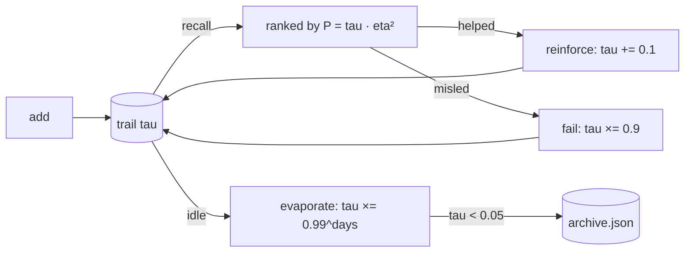

<table>
  <tr>
    <td width="155" align="center" valign="top">
      <br/>
      <sub><b>!DX&#8209;Kine</b><br/>author &amp; creator<br/><i>inspired by a true story</i></sub>
    </td>
    <td valign="middle">
      <h1>AoC Memory For AI Agent</h1>
      <p><b>Pheromone-trail memory for AI agents — Ant Colony Optimization, without the infrastructure.</b></p>
      <p>Memories behave like ant trails: used ones grow stronger, idle ones evaporate, contradicted ones collapse. Retrieval is plain numeric ranking. No embeddings. No vector DB. Zero dependencies.</p>
      <p>
        <a href="LICENSE"></a>
        
        
      </p>
      <p><sub>Inspired by a true story: <a href="https://doi.org/10.1109/3477.484436">M. Dorigo, V. Maniezzo &amp; A. Colorni (1996), "Ant System: optimization by a colony of cooperating agents", IEEE Trans. on Systems, Man, and Cybernetics — Part B, 26(1), pp. 29–41. doi:10.1109/3477.484436</a></sub></p>
    </td>
  </tr>
</table>

## Why

LLM agents lose context between sessions. The usual fixes each have a cost: replaying transcripts is expensive, vector databases need infra and embedding calls, and plain note files only ever grow. This borrows the ACO idea — ants leaving pheromone trails that fade unless reinforced — and applies it to notes. Every memory carries a strength value `tau` that decays with idle time and gets reinforced by real outcomes. What the agent actually uses stays alive; what it never uses quietly archives itself.

## How it works



- **Retrieval rank:** `P = tau^alpha * eta^beta` with `alpha=1, beta=2` — query relevance dominates, pheromone breaks ties.
- **`eta` (desirability):** token overlap between query and entry, scaled by the entry's success ratio (0.5 prior for untried entries).
- **Evaporation:** `tau *= (1 - rho)^idle_days` with `rho = 0.01/day`. A fresh trail halves after ~69 idle days and sinks below the forget threshold (0.05) after ~298 days.
- **Reinforcement:** proven useful → `tau += 0.1, success+1`. Misleading → `tau *= 0.9, fail+1`.
- **Contradiction (`spike`):** `tau *= 0.5`, optionally linked to the replacement via `--superseded-by`.
- **Forgetting (`decay`):** entries below `tau = 0.05` move to `archive.json`. Nothing is hard-deleted.
- **Near-duplicates:** content with Jaccard ≥ 0.8 against an existing trail merges into it (re-learn) instead of storing a copy.

## Quickstart

Python 3.8+, nothing to install:

```bash
git clone https://github.com/MyKineID/aoc-memory-for-ai-agent.git
cd aoc-memory-for-ai-agent

# store a memory (use the words you will query with later)
python3 ant_memory.py add "deploy preview runs via GH Actions on every push" --tags ci,deploy

# retrieve, ranked by P = tau^1 * eta^2
python3 ant_memory.py recall "how does deploy work" --n 5

# a trail provably helped / did not help
python3 ant_memory.py reinforce 3f9a12c0
python3 ant_memory.py fail 3f9a12c0

# new info contradicts an old trail
python3 ant_memory.py spike 3f9a12c0 --superseded-by <new-id>

# global evaporation + prune (once per heavy session, or cron it)
python3 ant_memory.py decay
```

Data lives in `~/.ant-memory/` by default. Set `ANT_MEMORY_DIR` to relocate it — that is also how you isolate multiple agents or test runs.

## CLI reference

| Command | Effect |
|---|---|
| `add "fact" --tags a,b` | store a new trail (`--force` skips near-duplicate merge) |
| `recall "query" --n 5` | top trails ranked by `P`, refreshes their idle timer |
| `reinforce <id>` | `tau += 0.1`, `success+1` |
| `fail <id>` | `fail+1`, `tau *= 0.9` |
| `spike <id>` | `tau *= 0.5`, mark contradicted |
| `decay` | evaporate all + prune below threshold to archive |
| `list` | all trails sorted by strength |
| `forget <id>` | manual archive |

Entry shape: `{id, content, tags, tau, success, fail, created, last_access}`. IDs are the first 8 hex chars of the content hash; any unique prefix is accepted.

## Wiring it into an agent

`SKILL.md` at the repo root is a ready-made skill file (Hermes/Claude-style frontmatter). The working loop:

1. Before answering from past experience: `recall` the topic first.
2. After a trail demonstrably led to a working solution: `reinforce`. When it wasted the attempt: `fail`.
3. Once per heavy session: `decay`.
4. When a trail proves permanently valuable, promote it to real long-term storage (system prompt, native memory, docs) and let the trail fade naturally.

Routing guidance: this store fits *living* knowledge — work patterns, research findings, project facts that stay useful through repeated access. Identity, credentials, and permanent procedures belong in dedicated long-term memory, because evaporation eventually eats even reinforced trails that are rarely queried (~298 idle days from fresh).

## Robustness

- Atomic writes (`tmp` + `os.replace`) with an exclusive `flock` on every write command — parallel agent processes on one store do not corrupt it.
- A corrupted store file is salvaged automatically: intact JSON objects are recovered, the broken original is kept as `*.corrupt.<timestamp>`.
- Idempotent learning: identical content is a re-learn, paraphrases merge, `--force` bypasses merging.

## Development

```bash
python3 tests/test_smoke.py
```

13 tests covering add / re-learn / merge / force, recall ranking, reinforce / fail / spike, decay pruning with backdating, forget, corruption salvage, and 10-way concurrent writes.

## License

MIT — see [LICENSE](LICENSE).
